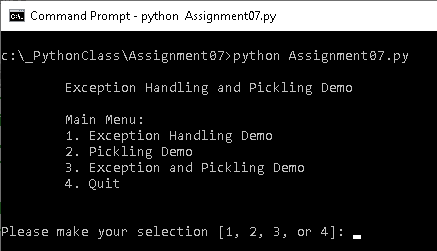
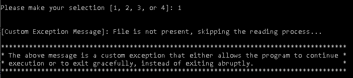

Rufus Ayeni  
November 24, 2020  
IT FDN 110 A  
Assignment 07  
https://github.com/rayeni/IntroToProg-Python-Mod07  

# Error Handling and Pickling Demo

## Introduction:

In Assignment 07, I researched error handling and picking and applied that research by creating a  
script that demonstrates the two concepts.  I found the following URLs useful in my research  
because the conveyed the concepts in a clear and concise manner:  

**The Python pickle Module: How to Persist Objects in Python:**  
https://realpython.com/python-pickle-module/  

**Introduction to Python Exceptions:**  
https://realpython.com/courses/introduction-python-exceptions/  

**Python Exceptions: An Introduction:**  
https://realpython.com/python-exceptions/  

The script is comprised of three demonstrations:  

1.	Exception handling demo.
2.	Pickling demo.
3.	Exception and pickling demo.

The above items are presented to the user as options at the start of the script:  

  
 **Figure 1**

## 1 Exception Handling Demo:  

Bugs are a part of programming.  As a programmer, you must anticipate the occurrence of errors  
and devise methods to catch and handle them.  If these errors *(also known as exceptions)*  
are not anticipated and addressed ahead of time, they can terminate your program abruptly  
and issue an error message that may not be easily interpreted by the user.  

One way to handle exceptions in Python is through the use of the try and except clauses.  

When error occurs in a Python program, if there isn’t any exception handling coded into the script,  
then the program will stop executing and exit abruptly.

1.	When Option #1, *Exception Handling Demo,* is selected, the demo captures the exception (FileNotFoundError), and presents a custom message to the user.  As seen in Figure 2:  

  
 **Figure 2**
