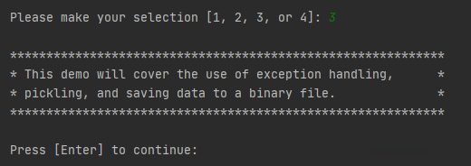
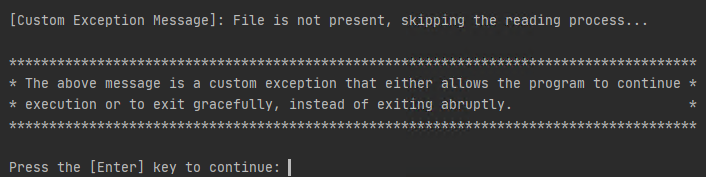
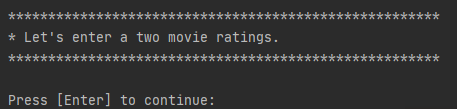
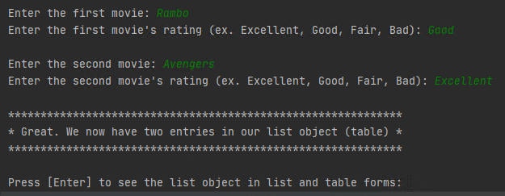
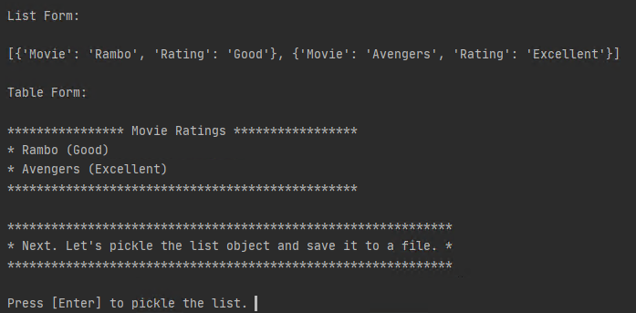
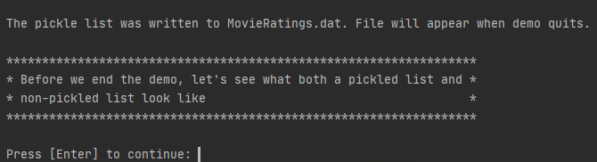
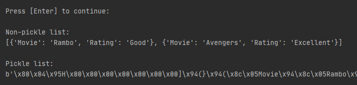
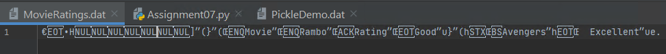

Rufus Ayeni  
November 24, 2020  
IT FDN 110 A  
Assignment 07  
<https://github.com/rayeni/IntroToProg-Python-Mod07>  

# Error Handling and Pickling Demo

## Introduction:

In Assignment 07, I researched error handling and picking and applied that research by creating a  
script that demonstrates the two concepts.  I found the following URLs useful in my research  
because the conveyed the concepts in a clear and concise manner:  

**The Python pickle Module: How to Persist Objects in Python:**  
<https://realpython.com/python-pickle-module/>  

**Introduction to Python Exceptions:**  
<https://realpython.com/courses/introduction-python-exceptions/>  

**Python Exceptions: An Introduction:**  
<https://realpython.com/python-exceptions/>  

The script is comprised of three demonstrations:  

1.	Exception handling demo.
2.	Pickling demo.
3.	Exception and pickling demo.

The above items are presented to the user as options at the start of the script:  

  
 **Figure 1**

## 1 Exception Handling Demo:  

Bugs are a part of programming.  As a programmer, you must anticipate the occurrence of errors  
and devise methods to catch and handle them.  If these errors *(also known as exceptions)*  
are not anticipated and addressed ahead of time, they can terminate your program abruptly  
and issue an error message that may not be easily interpreted by the user.  

One way to handle exceptions in Python is through the use of the try and except clauses.  

When error occurs in a Python program, if there isn’t any exception handling coded into the script,  
then the program will stop executing and exit abruptly.

1.	When **Option #1**, *Exception Handling Demo,* is selected, the demo captures the exception (```FileNotFoundError```), and presents a custom message to the user.  As seen in Figure 2:  

      
      **Figure 2**  
      
2.	The code for this demo starts in the while loop.  It starts by making a function call to the ```Processor.demo_exception_handler()``` function, and then to the ```IO.input_press_enter_to_continue()``` function.    
The following is a snippet of the code can be seen in **Figure 3**:  

```
while(True):
    IO.print_menu_options()
    menu_choice = IO.input_menu_choice()

    if menu_choice.strip() == "1": # Exception Handling Demo
        Processor.demo_exception_handler(demo_file_1)
        IO.input_press_enter_to_continue("\nPress the [Enter] key to return to Main Menu: ")
        continue  
```  
**Figure 3**  

The code for ```Processor.demo_exception_handler()``` and ```IO.input_press_enter_to_continue()``` can be seen in **Figures 4 and 5**:  

```
class Processor:
    """ Contains Processing Functions """

    @staticmethod
    def demo_exception_handler(file_name):
        """ Demonstrates how exception handling works"""

        # deletes file to demonstrate exception handling
        if os.path.exists(file_name):
            os.remove(file_name)

        # exception handler
        try:
            open(file_name, "rb")
        except FileNotFoundError:  # Exception generates following message:
            print("\n[Custom Exception Message]: File is not present, skipping the reading process...\n")
            print("**************************************************************************************")
            print("* The above message is a custom exception that either allows the program to continue *")
            print("* execution or to exit gracefully, instead of exiting abruptly.                      *")
            print("**************************************************************************************")  
```  
**Figure 4**

```
    @staticmethod
    def input_press_enter_to_continue(message):
        input(message)
```  
**Figure 5**  

## 2 Pickling Demo:  

The pickling demo converts a list to a data stream and stores the stream on disk.  

1.	When **Option #2,** *Pickling Demo*, is selected, the user is presented a brief definition of pickling, and is asked to press ```Enter``` to continue (**Figure 6**):  

      
      **Figure 6** 

2.	After the user presses ```Enter``` to continue, he/she is presented with a brief comment about the demo (**Figure 7**):  

      
      **Figure 7**

3.	The script continues with the task of creating a list of three cars:  

      
      **Figure 8**  

4.	After entering three cars into the list, the script asks the user to press ```Enter``` to pickle the list (**Figure 9**):  

      
      **Figure 9**  

5.	After the pressing ```Enter``` to pickle the list, the script prints a message to inform the user that the pickled  
list was saved to a file named ```PickleDemo.dat.``` The demo ends with the user pressing ```Enter``` to return to the Main Menu:  

      
      **Figure 10**  
      
6.	The code for the pickling demo entails three function calls to input items, add items to a list, and to pickle the list  
as seen in **Figure 11**:

```
    if menu_choice.strip() == "2":  # Pickling Demo
        demo_item1, demo_item2, demo_item3 = IO.input_demo_list_items()
        list_demo = Processor.add_data_to_list(demo_item1, demo_item2, demo_item3, list_demo)
        Processor.pickle_object_to_file(list_demo, demo_pickle_file)
        IO.input_press_enter_to_continue("\nPress the [Enter] key to return to Main Menu: ")
        continue
```
**Figure 11**

7.	The code for the functions can be viewed in **Figures 12, 13, and 14**:  

**def input_demo_list_items()**
```
    @staticmethod
    def input_demo_list_items():
        """Gets demo list items from user """

        print("*******************************************************")
        print("* Pickling is the process of converting an object to  *")
        print("* a stream of bytes (serialization) that can be saved *")
        print("* to disk.                                            *")
        print("*******************************************************")

        # Ask user to press Enter to continue with demo.
        input("\nPress [Enter] to continue: ")

        print("\n********************************************************")
        print("* In this demo we will create a three element list,    *")
        print("* pickle it, and save it to a binary file.             *")
        print("********************************************************")

        # Ask user to press Enter to continue with demo.
        input("\nPress [Enter] to continue: ")

        print("\n*******************************************************")
        print("* Let's create a list of three cars.                  *")
        print("*******************************************************")

        # Ask user to press Enter to continue with demo.
        input("\nPress [Enter] to continue: ")

        car1 = input("\nEnter the first car (ex. Volt, Prius, etc): ")
        car2 = input("Enter the second car (ex. Volt, Prius, etc): ")
        car3 = input("Enter the third car (ex. Volt, Prius, etc): ")

        return car1, car2, car3
```
**Figure 12**

**def add_data_to_list()**
```
    @staticmethod
    def add_data_to_list(element1, element2, element3, demo_list):
        """ Adds data to demo_list and returns it """

        demo_list = [element1, element2, element3]
        return demo_list
```
**Figure 13**

**def pickle_object_to_file()**
```
    @staticmethod
    def pickle_object_to_file(demo_list, demo_file):
        """ Pickles list and adds to file """

        input("\nPress [Enter] to pickle the list. ")
        print()  # whitespace
        f = open(demo_file, "wb")  # open binary file
        pickle.dump(demo_list, f)  # pickle list and write to file
        f.close()  # close file
        # create a pickle object (only to print to screen in demo)
        pk_object = pickle.dumps(demo_list)
        # print confirmation message
        print(f'The pickle list was written to {demo_file}. File will appear when demo quits. ')
        return pk_object
```
**Figure 14**

## 3 Exception and Pickling Demo:

The exception and pickling demo combines the previous two demos (*exception handling and pickling demos*).

1.	When the user selects **Option #3**, *Exception and Pickling Demo*, he/she is presented with a brief  
overview of the demo as seen in **Figure 15**:  

      
      **Figure 15**
      
2.	When the user presses ```Enter``` to continue, as seen in the previous demo, he/she is presented  
with a custom exception message telling him/her that the file is not present for reading.  
Instead of exiting abruptly, the program continues to run:  

      
      **Figure 16**

3.	After the user presses ```Enter``` to continue, the user is informed they will enter two  
movie ratings (*Movie Title, and Rating*):

      
      **Figure 17**
      
4.	After the user enters his movie ratings, he receives confirmation that the items are in a list, 
and is asked press ```Enter``` to see the data in both list and table forms:

      
      **Figure 18**

5.	After the data is presented to the user in list and table forms, the user is asked to 
press ```Enter``` to pickle the list:

      
      **Figure 19**

6.	After the user presses ```Enter``` to pickle the list, he is notified that the pickled list  
can be viewed in a file named ```MovieRatings.dat```:

      
      **Figure 20**

7.	After the user presses ```Enter``` to continue, both lists (*pickled and non-pickled*) are shown  
to the user for comparison:

      
      **Figure 21**
      
8.	The contents of MovieRating.dat can be seen in **Figure 22**:

      
      **Figure 22**
  
9.	The code for exception and pickling demo entails 11 function calls as seen in **Figure 23**:

```
    if menu_choice.strip() == "3":  # Exception and Pickling Demo
        # Print demo purpose
        IO.print_exception_pickling_intro()
        # Trigger exception and its handling
        Processor.demo_exception_handler(demo_movie_file)
        # Instruct user to press Enter to continue
        IO.input_press_enter_to_continue("\nPress the [Enter] key to continue: ")
        # Print instruction
        IO.print_message("Let's enter a two movie ratings.")
        # Have user enter movie and rating
        movie, movie_rating = IO.input_movie("the first")
        # Add movie and rating to table
        Processor.add_movie_rating(movie, movie_rating, lst_table)
        # Have user enter movie and rating
        movie, movie_rating = IO.input_movie("the second")
        # Add movie and rating to table
        Processor.add_movie_rating(movie, movie_rating, lst_table)
        # Show table
        IO.print_table(lst_table)
        # pickle list object and save to binary file
        pickle_object = Processor.pickle_object_to_file(lst_table, demo_movie_file)
        # show pickle list object
        IO.show_pickle_object(pickle_object, lst_table)
```  
**Figure 23**  

## Summary:

In this assignment, I created a Python script that demonstrates exception handling and pickling.  
Exception handling is an important concept in programming that requires programmers to anticipate  
and capture errors that users may trigger as a result of faulty programming logic.  Pickling is  
the conversion of a Python object to a byte stream.  In other programming languages, this is  
called serialization.   The purpose of serializing Python objects is to lower the time it takes  
to read and write data to disk.

